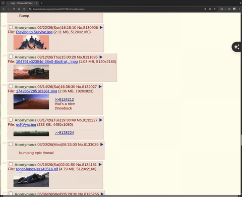

# Scrollock

**Windows-style autoscroll for Linux/Wayland.** Double-click or hold your middle mouse button to lock scroll mode — move to scroll, click to stop. No holding required.



## Why Scrollock?

Every Linux-from-Windows switcher asks the same question: *"Where's my middle-click autoscroll?"*

The answer used to be "nowhere" — existing solutions are X11-only or require holding the button. Scrollock fixes that:

- **Toggle scroll mode** — double-click middle button or hold it ~200ms to lock. Move to scroll. Click anything to exit.
- **Normal middle-click preserved** — quick clicks still close tabs, open links in new tabs, paste.
- **System-wide** — works in every app (browsers, file managers, terminals, IDEs).
- **Wayland-native** — evdev/uinput at kernel level. No X11 dependency.
- **Visual indicator** — shows when scroll mode is active.

## Install

### Quick Install (one command)

If you already have Rust installed:

```bash
curl -sSf https://raw.githubusercontent.com/villa1337/scrollock/main/install.sh | bash
```

This builds from source, sets up permissions, detects your mouse, and starts the service. **No relogin required.**

### From Scratch (fresh system)

If you're starting from a clean Linux install, here's everything you need:

**1. Install Rust:**

```bash
curl --proto '=https' --tlsv1.2 -sSf https://sh.rustup.rs | sh
```

Follow the prompts (default options are fine). Then load it into your current shell:

```bash
source "$HOME/.cargo/env"
```

**2. Install system dependencies:**

Fedora/RHEL:
```bash
sudo dnf install gcc python3 gtk4
```

Ubuntu/Debian:
```bash
sudo apt install build-essential python3 libgtk-4-1
```

Arch/Manjaro:
```bash
sudo pacman -S base-devel python gtk4
```

**3. Install Scrollock:**

```bash
curl -sSf https://raw.githubusercontent.com/villa1337/scrollock/main/install.sh | bash
```

The installer will:
- Build and install the `scrollock` binary
- Install a visual overlay indicator (GTK4)
- Set up udev rules for device access (will ask for sudo)
- Add your user to the `input` group
- Detect your mouse interactively
- Create a config at `~/.config/scrollock/config.toml`
- Install and start a systemd user service

**4. You're done!** Try double-clicking your middle mouse button.

### Requirements

- Linux with Wayland (GNOME, Hyprland, Sway, KDE Plasma)
- Rust toolchain (see step 1 above)
- systemd (for the user service)
- Python 3 + GTK4 (for the visual indicator — scroll works without it)
- A mouse with a middle button

## How It Works

| Action | Result |
|--------|--------|
| Quick middle-click | Normal click (close tab, paste, open in new tab) |
| Double middle-click | **Enter scroll mode** (locked) |
| Hold middle button ~200ms | **Enter scroll mode** (locked) |
| Hold + move past deadzone | Scroll while holding (classic behavior) |
| Move mouse while in scroll mode | Page scrolls (speed follows distance) |
| Any click while in scroll mode | **Exit scroll mode** |

Three ways to enter scroll mode, all natural:
1. **Double-click** — fast tap-tap on the middle button
2. **Hold** — press and hold for a beat (~200ms)
3. **Hold + move** — press and drag past the deadzone (instant, like classic autoscroll)

## Configuration

Config file: `~/.config/scrollock/config.toml`

```toml
# Mode: "toggle" (default) or "hold_progressive" (classic hold-to-scroll)
mode = "toggle"

# Time window for double-click detection and hold threshold (ms)
# Lower = snappier single-clicks but tighter double-click window
hold_threshold_ms = 200

# Pixels of movement before scroll activates (when holding)
deadzone_units = 10

# Speed curve
acceleration_exponent = 1.6
# min/max scroll speed (detents per second)
# min_speed_detents_per_second = 1.5
# max_speed_detents_per_second = 32.0

# Scroll direction
invert_vertical = false
invert_horizontal = false

# Enable horizontal scrolling (move mouse left/right)
horizontal_scroll = true

[device_match]
vendor_id = "046d"
product_id = "c07d"
name = "Logitech Gaming Mouse G502"
```

After editing, restart: `scrollock --restart` (or `slk --restart`)

## Commands

```bash
scrollock --start          # Start the daemon
scrollock --stop           # Stop the daemon
scrollock --restart        # Restart (pick up config changes)
scrollock --list-devices   # List detected mice
scrollock --setup          # Interactive mouse detection + config write

slk --start               # Short alias for all commands
```

## Modes

### Toggle (default)
- Double-click or hold to **lock** scroll mode
- Release doesn't exit — you scroll freely hands-off
- Any click exits

### Hold Progressive (classic)
- Hold middle button + move to scroll
- Release exits immediately
- Set with `mode = "hold_progressive"` in config

## Uninstall

```bash
curl -sSf https://raw.githubusercontent.com/villa1337/scrollock/main/uninstall.sh | bash
```

Or manually:
```bash
scrollock --stop
scrollock --remove-service
rm -f ~/.cargo/bin/scrollock ~/.cargo/bin/slk
rm -rf ~/.config/scrollock
rm -f ~/.local/bin/scrollock-indicator
sudo rm -f /etc/udev/rules.d/60-scrollock.rules
```

## Troubleshooting

**Mouse not detected:**
```bash
scrollock --list-devices   # Find your mouse
# Edit ~/.config/scrollock/config.toml with the correct vendor_id/product_id
scrollock --restart
```

**Permission denied:**
```bash
# Quick fix (immediate, no relogin):
sudo setfacl -m "u:$USER:rw" /dev/input/eventX   # replace X with your mouse
sudo setfacl -m "m::rw" /dev/input/eventX
sudo setfacl -m "u:$USER:rw" /dev/uinput

# Permanent fix:
sudo usermod -aG input $USER
# Then relogin
```

**Service won't start:**
```bash
journalctl --user -u scrollock -f   # Check logs
scrollock --dry-run -vv             # Test without grabbing mouse
```

## How It's Built

Scrollock is a fork of [Wayland-Wheeltani](https://github.com/docloulou/Wayland-Wheeltani) with major additions:

- Platform-agnostic core engine (`scrollock-core`) with full test coverage
- Linux daemon (`scrollock`) using evdev for input capture and uinput for synthetic events
- The daemon exclusively grabs your physical mouse, creates a virtual mouse, and passes all events through transparently — except middle-button gestures which it intercepts for scroll control

```
Physical Mouse → [evdev grab] → Scrollock Engine → [uinput] → Virtual Mouse → Compositor
                                      ↓
                              Scroll wheel events
                              (when in scroll mode)
```

## Support

If Scrollock saved you from missing Windows autoscroll, consider buying me a coffee:

[](https://paypal.me/bennettone)

⭐ Star the repo if it helped you!

## License

[BSD Zero Clause](LICENSE) — do whatever you want, no attribution required.
